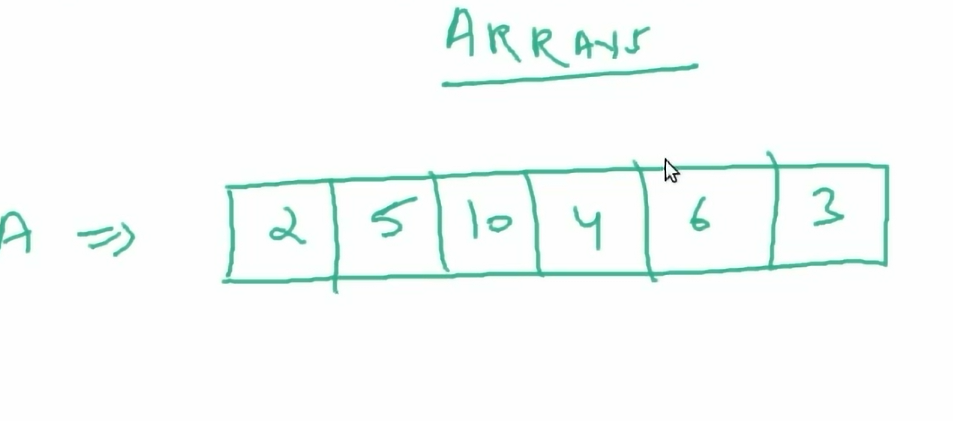
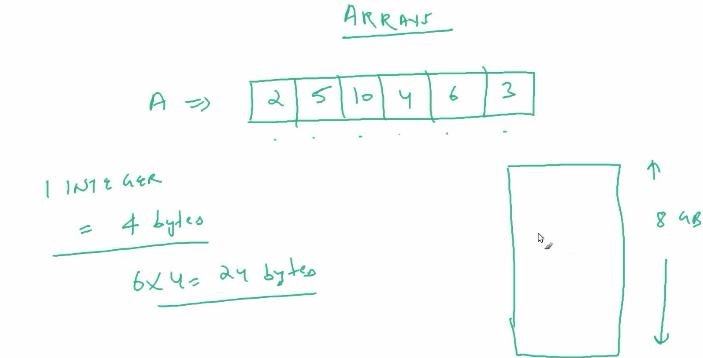
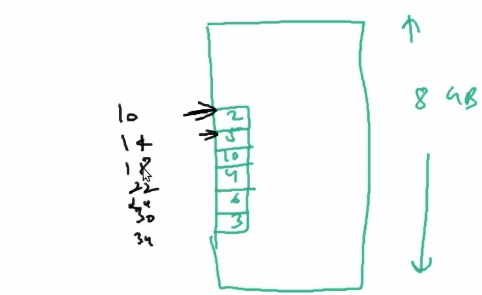

# Arrays-Lists
DSA-arrays-Lists 
## DSA-Arrays-list ##

| NO.|   Questions                                                                                                                                                              |
| ---| ------------------------------------------------------------------------------------------------------------------------------------------------------------------------------------------------------------------------------------------------------|
|    | **Types of Arrays-lists**                                                                                                                                                |
| 1  | [what-are-Arrays-and-how-they-are-stored](#)                                                                                                                             |
| 2  | [How-are-Arrays-accessed](#)                                                                                                                                             |
| 3  | [Disadvantages-of-standard-arrays](#)                                                                                                                                    |
| 4  | [How-are-resizable-Arrays-Implemented](#)                                                                                                                                |
| 5  | [Resizable-Arrays-Implementation](#)                                                                                                                                     |
| 6  | [Resizable-Arrays-complexity-analysis](#)                                                                                                                                |

Here there are important DSA concepts, one of which is "Arrays and Lists" programming in Java scripting. The main concepts are as follows

<!--<ul>
  
<li>what are Arrays and how they are stored  
<li>How are Arrays accessed  
<li>Disadvantages of standard arrays  
<li>How are Resizable arrays implemented  
<li>Resizable arrays implementation  
<li>Resizable arrays complexity analysis  

</ul>-->

# Important points about Arrays & List
 
| 2  | [How-are-Arrays-accessed](#)   

<!--# What are arrays and how they are stored-->

# 1 :
* Arrays conatains 'INTERGERS' and every integer contains 4-BITS and initially stars with left side with 10 and 'ADD' 4-BITS to it, For instancce [ 10, 10+4=14, 14+4=18 ] etc and information as given below *

# 2 :
**

# 3:
**

# 4:
**

<ol>
# Arrays
<li>*Arrays have a fixed length, which means that the number of elements in an array cannot be changed after it is created. However, you can add or remove elements from an array by using methods like push(), pop(), shift(), and unshift().</li>

# List
<li>*Lists are dynamic, which means that the number of elements in a list can grow or shrink as needed. You can add or remove elements from a list by using methods like push(), pop(), shift(), and unshift().</li>

# Arrays and Lists how it works 
<li>* Resiable arrays implementation & resiablle arrays implement with complex structure </li>

</ol>

