# Arrays-Lists
-----

### DSA Arrays List

| NO.|   Questions                                                                                                                                                             |
| ---| ------------------------------------------------------------------------------------------------------------------------------------------------------------------------------------------------------------------------------------------------------|
|    | **Types of Arrays-lists**                                                                                                                                               |
| 1  | [what-are-Arrays-and-how-they-are-stored](#)                                                                                                                            |
| 2  | [How-are-Arrays-accessed](#)                                                                                                                                            |
| 3  | [Disadvantages-of-standard-arrays](#)                                                                                                                                   |
| 4  | [How-are-resizable-Arrays-Implemented](#)                                                                                                                               |
| 5  | [Resizable-Arrays-Implementation](#)                                                                                                                                    |
| 6  | [Resizable-Arrays-complexity-analysis](#)                                                                                                                               |

Here there are important DSA concepts, one of which is "Arrays and Lists" programming in Java scripting. The main concepts are as follows

| 1  | [what-are-Arrays-and-how-they-are-stored](#) 

 # i:  Arrays stored
    An Array is a collections of data types in one format.
  

# ii: Stored with 4 bits 
   * Array has each data elecated with '4' bits, and the numbers we have taken 1'row' 6 'coloums', for instance: 4*6 coloum's=24 bits =>4 is bits & 6 is coloums.*
  

# iii: Total memory alocation
*Suppose if we have taken memory alocated with 8-gb is the data base server, then it actually depends on how many datatypes(Integer) we have taken , here I initiated with [10,14,18,22,26,30,34] each space occupy with 4 bits and added to further number in the below image [0,1,2,3,4,5]=>[10,14,18,22,26,30,34] *
  

 
| 2  | [How-are-Arrays-accessed](#)   

# 1 : Arrays access-left-right
* Arrays conatains 'INTERGERS' and every integer contains 4-BITS and initially stars with left side with 10 and 'ADD' 4-BITS to it, For instancce [ 10, 10+4=14, 14+4=18 ] etc and information as given below *
 
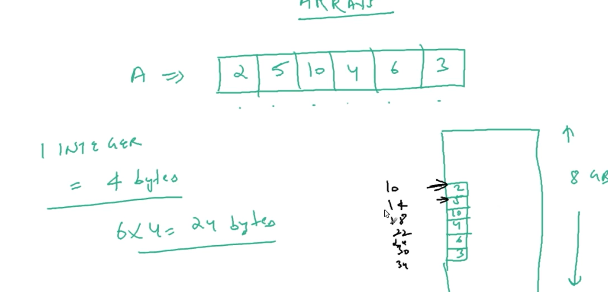

# 2 :
**
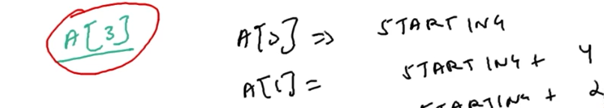

# 3:
**
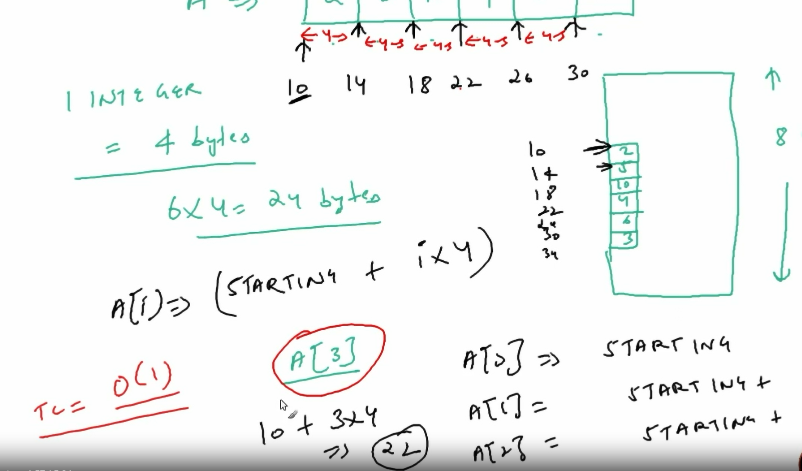

# 4:
**
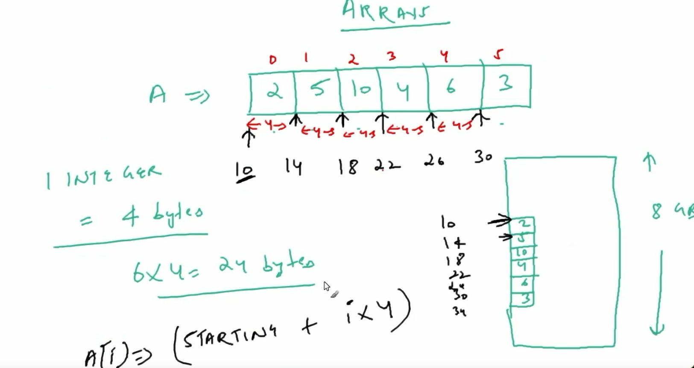

| 3  | [Disadvantages-of-standard-arrays](#)   

# 1:

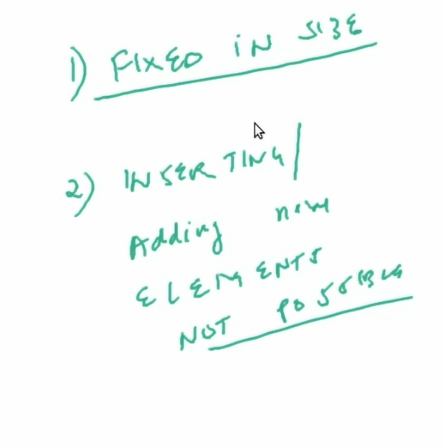

# 2:

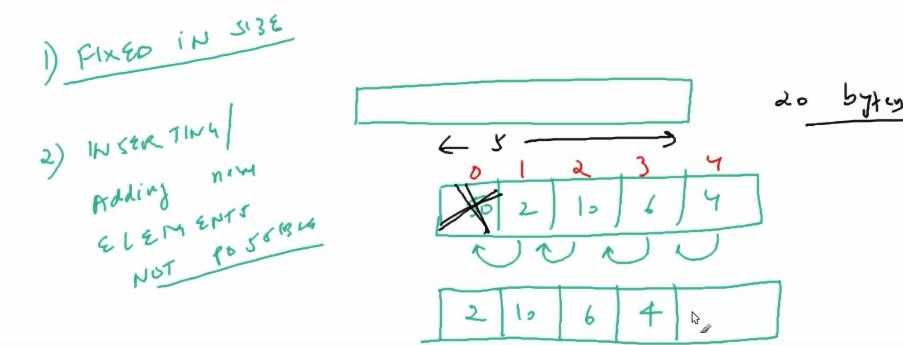

# 3:

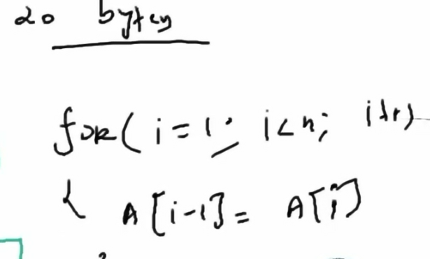

| 4  | [How-are-resizable-Arrays-Implemented](#) 

# 1:

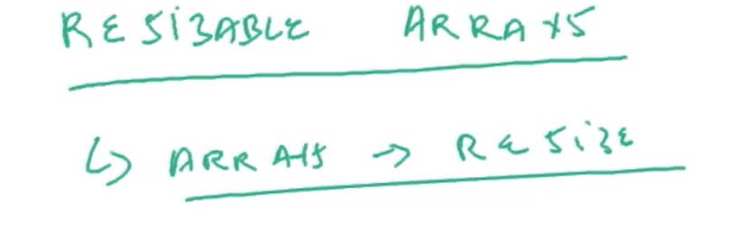

# 2:

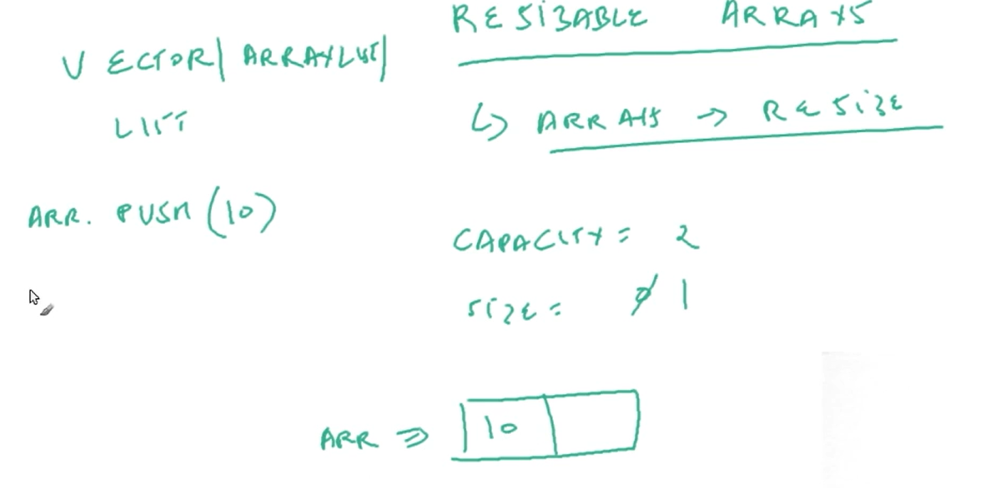

# 3:

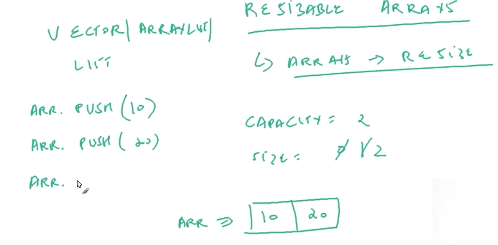

# 4:
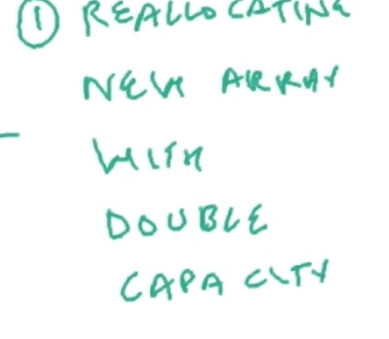

# 5:
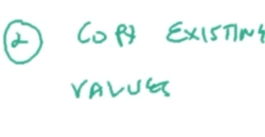

# 6:
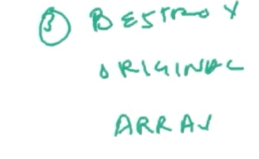

# 7:
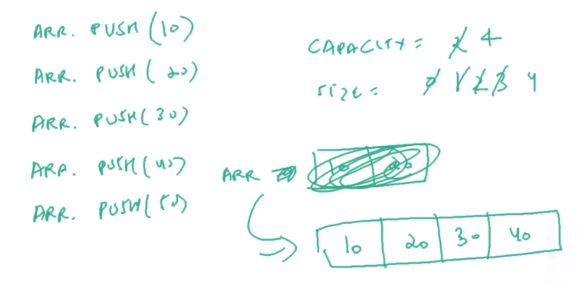

# 8:
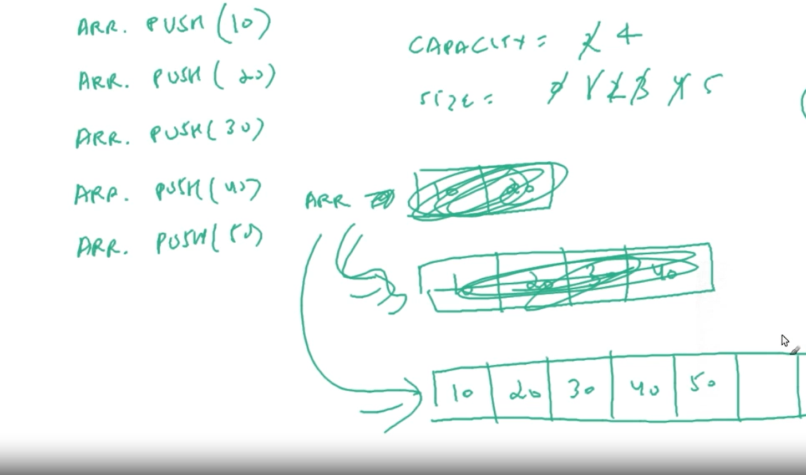

# 9:
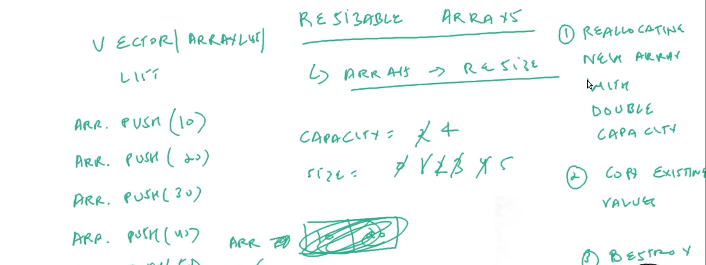

| 5  | [Resizable-Arrays-Implementation](#)
# 1: programming part

| 6  | [Resizable-Arrays-complexity-analysis](#)  

# 1:
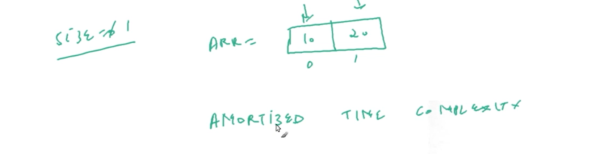

# 2:
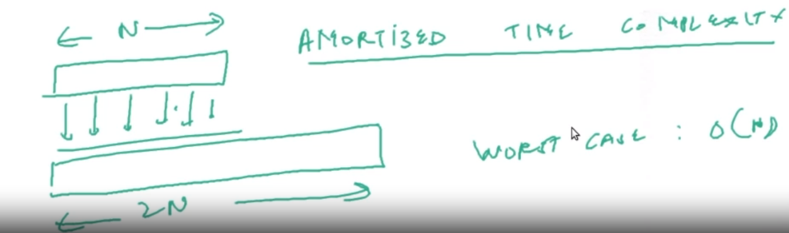

# 3:
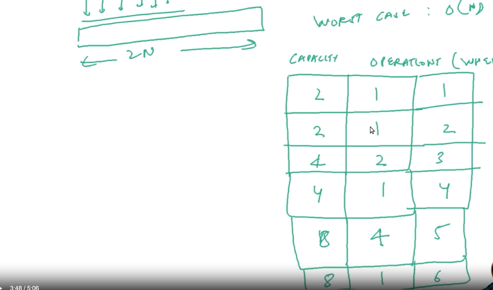

# 4:
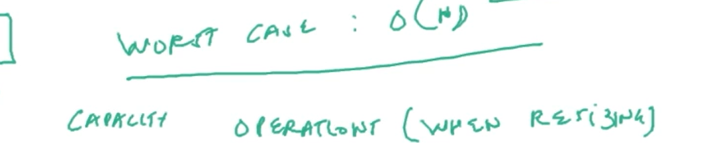

# 5:
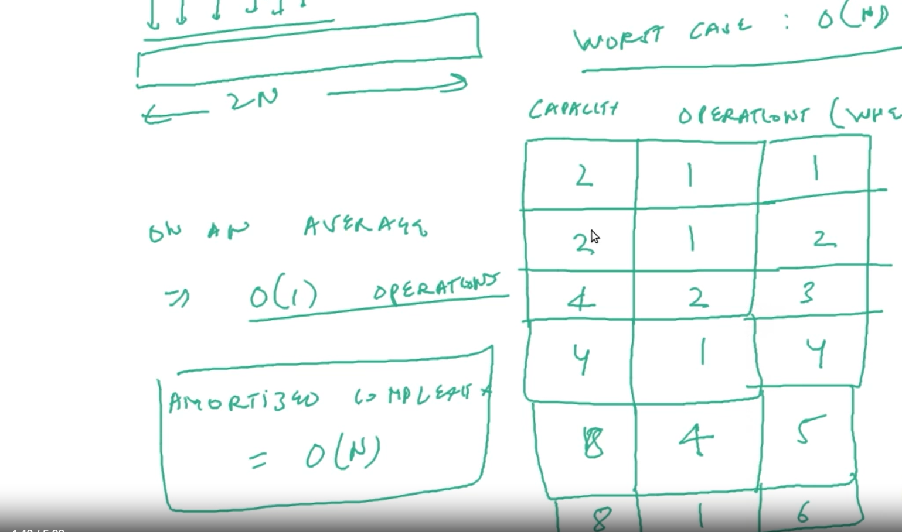

 **[⬆ Back to Top](#DSA-Arrays-List)**

<!--<ol>
# Arrays
<li>*Arrays have a fixed length, which means that the number of elements in an array cannot be changed after it is created. However, you can add or remove elements from an array by using methods like push(), pop(), shift(), and unshift().</li>

# List
<li>*Lists are dynamic, which means that the number of elements in a list can grow or shrink as needed. You can add or remove elements from a list by using methods like push(), pop(), shift(), and unshift().</li>

# Arrays and Lists how it works 
<li>* Resiable arrays implementation & resiablle arrays implement with complex structure </li>

</ol>-->

